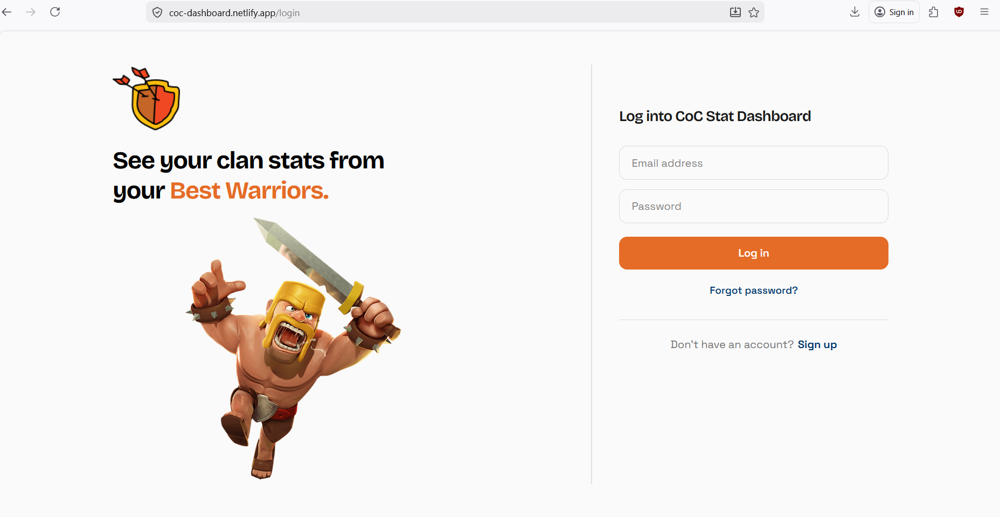
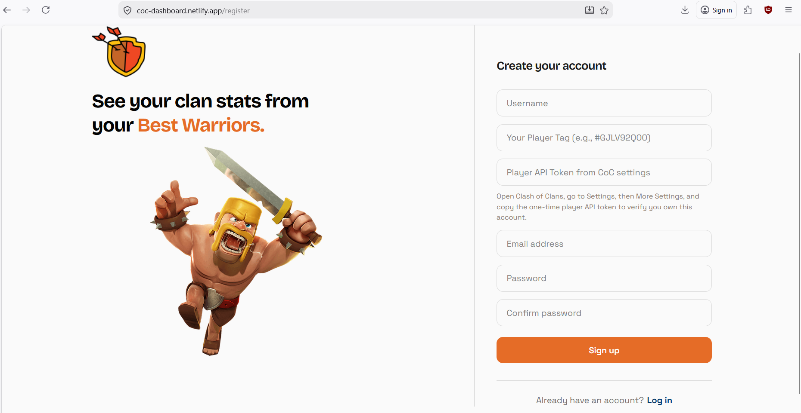
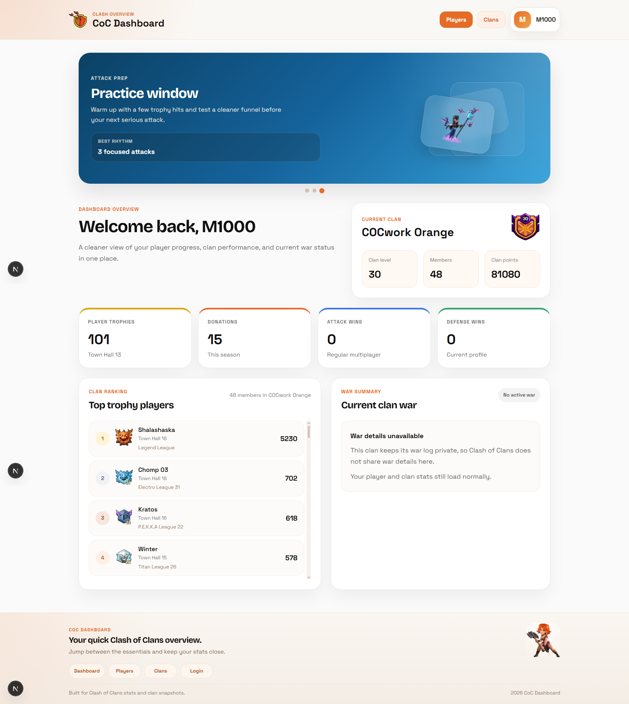
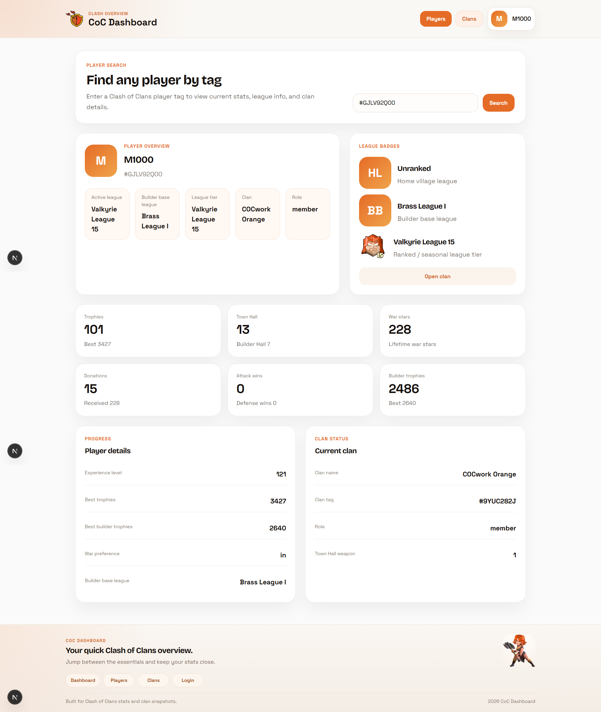
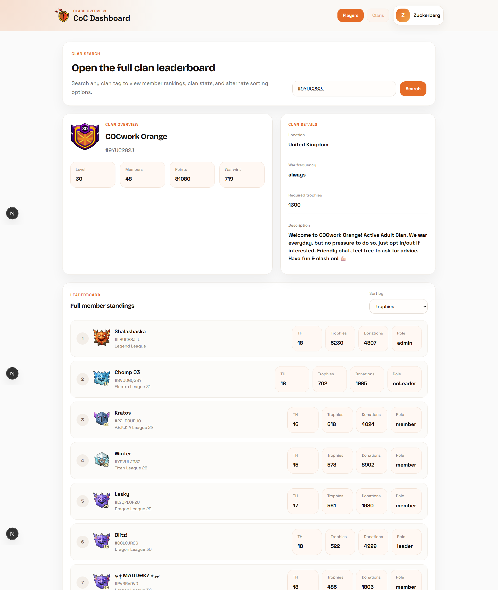
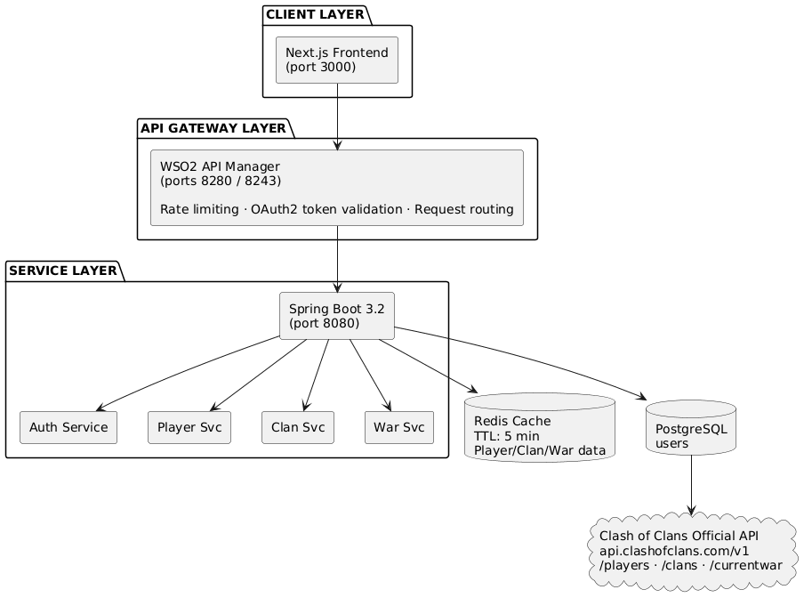

# CoC Dashboard — Backend

> A Clash of Clans analytics platform built with Spring Boot, fronted by WSO2 API Manager as an enterprise API gateway.

---

## Screenshots







---

## Tech Stack

| Layer | Technology |
|---|---|
| Language | Java 17 |
| Framework | Spring Boot 3.2.5 |
| API Gateway | WSO2 API Manager 4.x |
| Database | PostgreSQL 16 |
| Cache | Redis 7 |
| Security | Spring Security + JWT |
| ORM | Spring Data JPA + Hibernate |
| HTTP Client | RestTemplate |
| Containerisation | Docker + Docker Compose |
| Build Tool | Maven |

---


## Architecture



---


## Features

### Authentication
- User registration with **CoC player token verification** — users must prove they own the CoC account by providing their in-game API token
- BCrypt password hashing
- JWT token issuance on login and register
- Duplicate email/username/player tag detection

### Player Service
- Fetch real-time player stats from the CoC API
- Two-layer caching — Redis cache with 5-minute TTL, cache miss falls through to CoC API
- Full player profile: trophies, town hall level, donations, war stars, league info, builder base stats

### Clan Service
- Full clan profile with all 47+ member details
- Leaderboard endpoint sortable by trophies, donations, or town hall level
- Client pattern separating CoC API calls from business logic
- Redis caching per clan tag

### War Service
- Current war status — stars, destruction percentage, state
- War summary with win/loss/draw calculation logic
- Graceful handling of private war logs

### Infrastructure
- Global exception handler returning clean JSON error responses
- Custom exception types: `ResourceNotFoundException`, `DuplicateResourceException`, `ExternalApiException`
- Spring Actuator health endpoint
- Docker Compose spinning up the full stack with one command

---

## Key Engineering Decisions

**Why WSO2 API Manager?**
WSO2 acts as the single entry point for all API traffic. It handles OAuth2 token validation, rate limiting per user tier, and request routing — Spring Boot services never handle authentication themselves. This follows the correct API gateway pattern used in enterprise systems.

**Why Redis caching?**
The CoC API is rate-limited and IP-locked. Every player or clan lookup that can be served from Redis instead of the CoC API reduces external API pressure. Cache TTL of 5 minutes balances data freshness with API efficiency.

**Why the Client pattern?**
`ClanClient` and `WarClient` separate external HTTP calls from business logic. This avoids Spring `@Cacheable` self-invocation issues and makes each layer independently testable.

**Why feature-based package structure?**
```
com.punchibanda.coc
├── auth/          ← controller, service, dto, model, repository
├── player/        ← controller, service, dto
├── clan/          ← controller, service, dto, client
├── war/           ← controller, service, dto, client
├── config/        ← JWT, Security, Redis, App config
└── common/        ← exceptions, error DTOs
```
Each feature is self-contained. Easy to navigate, easy to extend.

---

## API Endpoints

All endpoints are proxied through WSO2 API Manager on port `8280`.

### Auth
| Method | Endpoint | Auth | Description |
|---|---|---|---|
| POST | `/api/v1/auth/register` | Public | Register with player tag verification |
| POST | `/api/v1/auth/login` | Public | Login, returns JWT |

### Player
| Method | Endpoint | Auth | Description |
|---|---|---|---|
| GET | `/api/v1/players/{tag}` | JWT | Full player stats |

### Clan
| Method | Endpoint | Auth | Description |
|---|---|---|---|
| GET | `/api/v1/clans/{tag}` | JWT | Full clan profile + member list |
| GET | `/api/v1/clans/{tag}/leaderboard` | JWT | Sorted member leaderboard |

### War
| Method | Endpoint | Auth | Description |
|---|---|---|---|
| GET | `/api/v1/wars/{clanTag}/current` | JWT | Full current war data |
| GET | `/api/v1/wars/{clanTag}/summary` | JWT | War summary with result |

---

## Local Setup

### Prerequisites
- Java 17
- Maven
- Docker Desktop
- WSO2 API Manager (Docker)
- A Clash of Clans API token from [developer.clashofclans.com](https://developer.clashofclans.com)

### 1. Clone the repository
```bash
git clone https://github.com/sasmitha-git/CoC-Dashboard.git
cd CoC-Dashboard
```

### 2. Configure environment variables
```bash
cp .env.example .env
```

Edit `.env`:
```properties
COC_API_TOKEN=your_coc_api_token_here
DB_PASSWORD=coc_password
JWT_SECRET=your_jwt_secret_here
```

### 3. Start WSO2 API Manager
```bash
docker run -it -p 9443:9443 -p 8280:8280 -p 8243:8243 --name wso2-apim wso2/wso2am:latest
```

### 4. Build the application
```bash
./mvnw clean package -DskipTests
```

### 5. Start the full stack
```bash
docker compose up -d --build
```

This starts:
- Spring Boot app on `http://localhost:8080`
- PostgreSQL on `localhost:5432`
- Redis on `localhost:6379`

### 6. Configure WSO2 API Manager

Go to `https://localhost:9443/publisher` and create a new API:

```
Name:     CoCDashboardAPI
Version:  v1
Context:  /api
Endpoint: http://coc-app:8080/api/v1
```

Add all resources, deploy and publish.

Connect WSO2 to the Docker network:
```bash
docker network connect coc-dashboard_default wso2-apim
```

### 7. Verify

```bash
curl http://localhost:8080/actuator/health
# {"status":"UP"}
```

---

## Frontend

The frontend is built with Next.js 15 and is available at:
👉 [CoC Dashboard Frontend](https://github.com/sasmitha-git/coc-dashboard-frontend)

Live demo: [https://coc-dashboard.netlify.app](https://coc-dashboard.netlify.app)

---

## Notes

- The CoC API requires IP whitelisting. Register your IP at [developer.clashofclans.com](https://developer.clashofclans.com)
- War data may be unavailable for clans with private war logs
- Redis cache TTL is set to 5 minutes — adjust in `RedisConfig.java`

---

## Author

**Sasmitha Kuruppu**
GitHub: [@sasmitha-git](https://github.com/sasmitha-git)